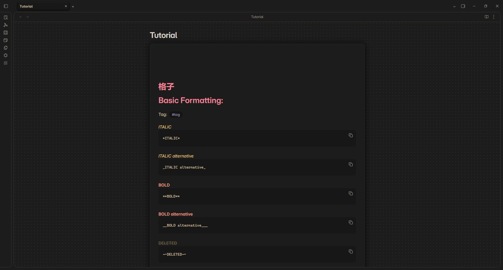
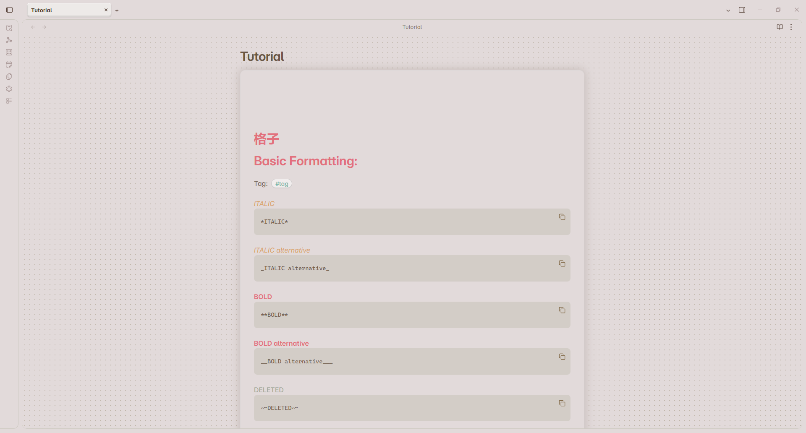

## Obsidian Lattice Theme Overlay

This project is not an actual [Obsidian Theme](https://obsidian.md/help/themes), but rather a collection of my personal settings gathered in one place and configured so they can be switched on and off with a single click. Currently, there are three presets that support the Default Theme, the [Vicious Theme](https://github.com/zaheralmajed/vicious-theme-obsidian) and the [Primary Theme](https://github.com/primary-theme/obsidian). The latter is the most extensive and complete, while the other two are relatively minimal and no longer up to date.

## Installation
1. Download one of the CSS files and install the corresponding theme
2. If not present, create a snippets folder in your `vault-folder/.obsidian` directory
3. Put the CSS file inside the `vault-folder/.obsidian/snippets` folder
4. Go to Settings $\to$ Appearance. Scroll down to "CSS snippets" and toggle the file to "on" (press the refresh button if it does not show up).
5. Install the [Style Settings](https://github.com/obsidian-community/obsidian-style-settings) community plugin to customize 

## Showcase (Lattice Primary)

<table>
  <tr>
    <td></td>
    <td></td>
  </tr>
    <tr>
    <td></td>
    <td></td>
  </tr>
    <tr>
    <td></td>
    <td></td>
  </tr>
    <tr>
    <td></td>
    <td></td>
  </tr>
</table>

Plugins used in showcase: [Advanced Canvas](https://github.com/Developer-Mike/obsidian-advanced-canvas), [Calendar](https://github.com/liamcain/obsidian-calendar-plugin), [Image Gallery](https://github.com/lucaorio/obsidian-image-gallery) and [Kanban](https://github.com/obsidian-community/obsidian-kanban).

