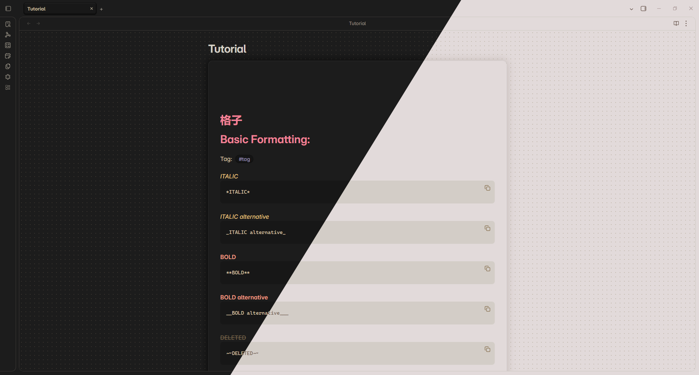
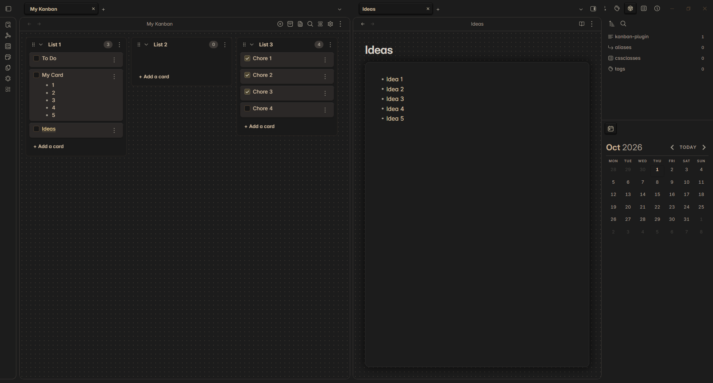
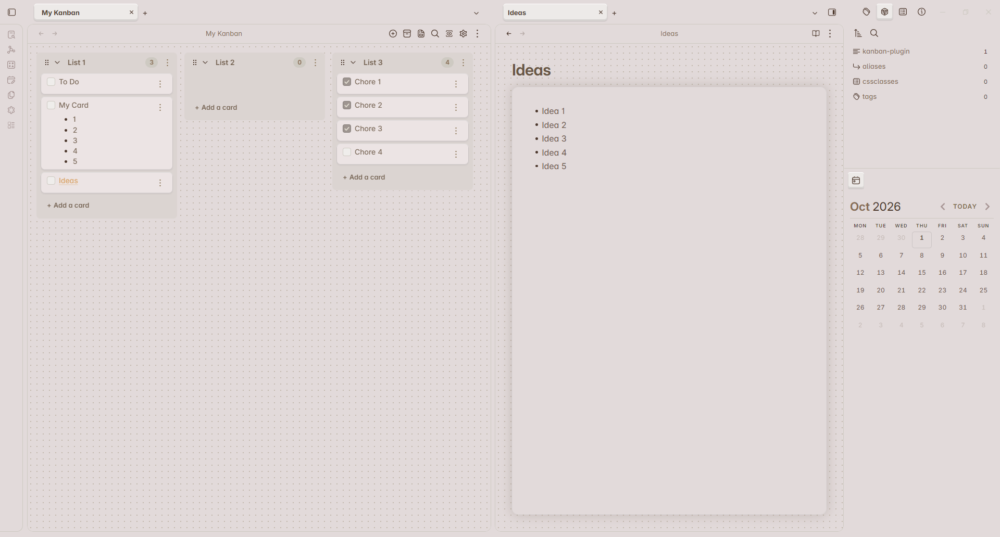
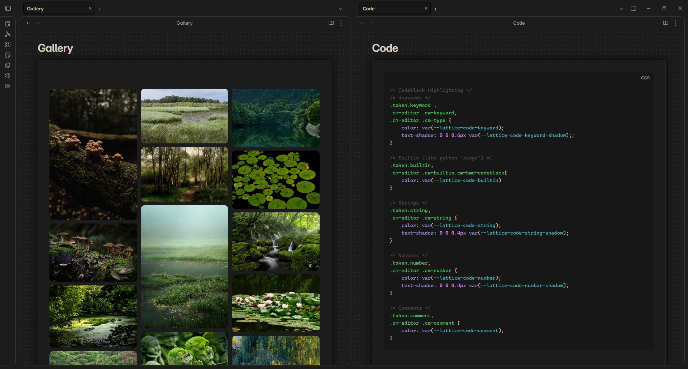
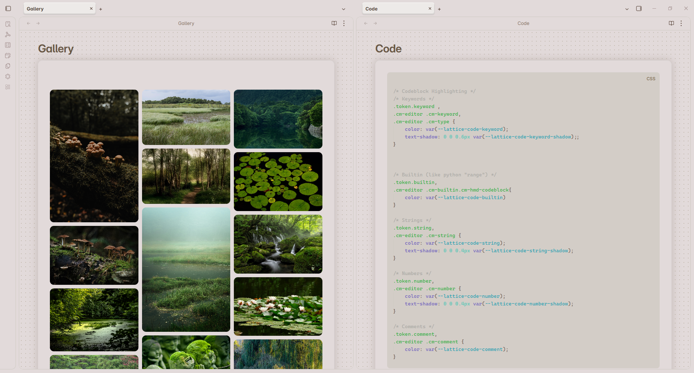
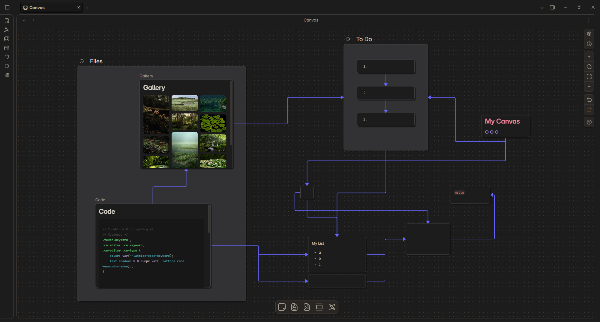
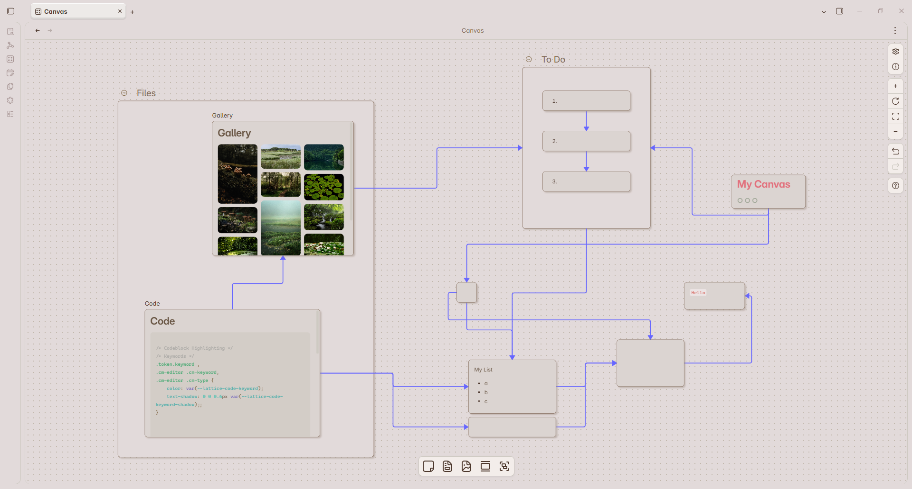

## Obsidian Lattice Theme Overlay

This project is not an actual [Obsidian Theme](https://obsidian.md/help/themes), but rather a collection of my personal settings gathered in one place and configured so they can be switched on and off with a single click. Currently, there are three presets that support the Default Theme, the [Vicious Theme](https://github.com/zaheralmajed/vicious-theme-obsidian) and the [Primary Theme](https://github.com/primary-theme/obsidian). The latter is the most extensive and complete, while the other two are relatively minimal and no longer up to date.

## Installation
1. Download one of the CSS files and install the corresponding theme
2. Go to Settings → Appearance. Click on "CSS snippets" and select the folder icon. Place the CSS file in the snippet folder and enable it (click the refresh button if it does not appear)
4. Install the [Style Settings](https://github.com/obsidian-community/obsidian-style-settings) community plugin to customize 

> Note that some of the theme's style settings will no longer work because the snippet overrides them. Use the snippet's settings instead.

## Showcase (Lattice Primary)

<table>
  </tr>
    <tr>
    <td></td>
    <td></td>
  </tr>
  </tr>
    <tr>
    <td></td>
    <td></td>
  </tr>
    <tr>
    <td></td>
    <td></td>
  </tr>
</table>

Plugins used in showcase: [Advanced Canvas](https://github.com/Developer-Mike/obsidian-advanced-canvas), [Calendar](https://github.com/liamcain/obsidian-calendar-plugin), [Image Gallery](https://github.com/lucaorio/obsidian-image-gallery) and [Kanban](https://github.com/obsidian-community/obsidian-kanban).

